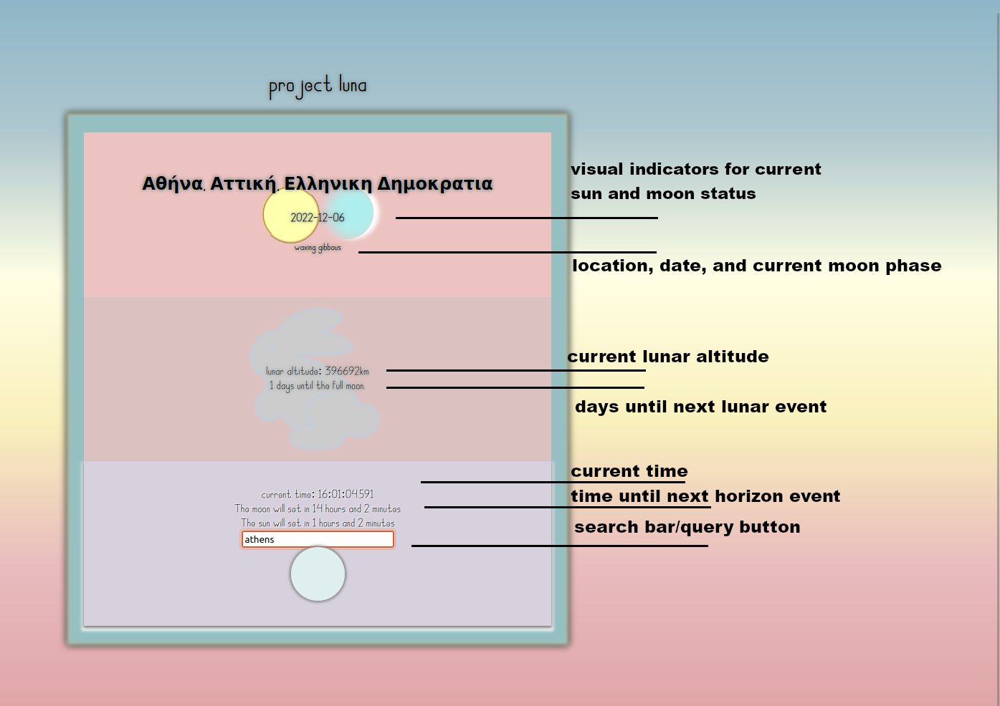

# Welcome to  project luna

project luna is a simple and streamlined interface for requesting lunar data.

the goal of this project is to provide useful information about the moon in an elegant and easy to read format.

data about the moon are acquired from external apis, and rendered into a concise and logical display.

simply enter your location in the text bar at the bottom of the page, and press the button to retrieve your data.

## technologies used
- html5
- css3
- jquery
- weather api from visualcrossing.com
- astronomy api from ipgeolocation.io
- 'the moon' font from cdnfonts.com

[click here](https://sailor-june.github.io/project-luna/) to try it out!

designed by juniper c. james 
junipercjames@gmail.com
https://www.linkedin.com/in/juniper-james-36467b257/